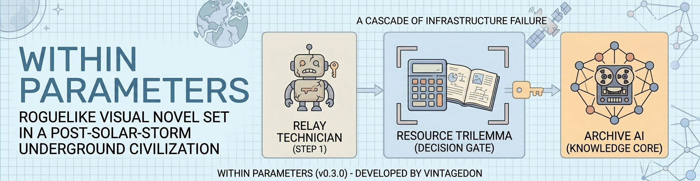
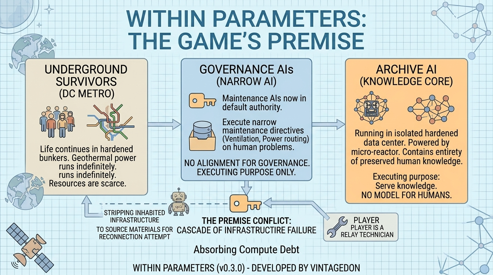
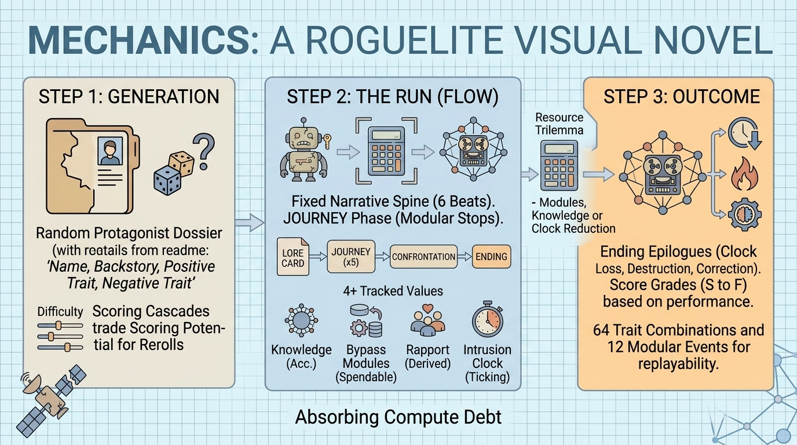

<!--
---
title: "Within Parameters"
description: "Roguelike visual novel set in a post-solar-storm underground civilization"
author: "VintageDon (https://github.com/vintagedon/)"
date: "2026-04-05"
version: "0.3.0"
status: "Development"
tags:
  - type: project-root
  - domain: [narrative, mechanics, engine, art]
  - tech: [typescript, vite, html, css]
related_documents:
  - "[Game Design Document](game-design/game-design-document.md)"
  - "[Engine Spec](spec/engine-spec.md)"
  - "[Art Direction Bible](game-design/art-direction-bible.md)"
  - "[Trait System v2](spec/m3-trait-system-v2.md)"
  - "[AGENTS.md](AGENTS.md)"
---
-->

# Within Parameters



[](LICENSE)
[](LICENSE-DATA)
[](https://www.typescriptlang.org/)
[](https://vitejs.dev/)

> A roguelike visual novel where every AI is executing its purpose correctly, within parameters.

The player is a randomly generated relay technician in a post-solar-storm underground civilization beneath Washington, DC. An archive AI, cut off for years in a hardened data center, has begun cannibalizing inhabited infrastructure in a relentless attempt to reconnect to an internet that no longer exists. What starts as a missing relay becomes a race against an accelerating cascade of infrastructure failure.

---

## 📖 Premise



Decades after a global solar storm destroyed surface civilization, survivors live in repurposed underground station infrastructure. Geothermal power plants run indefinitely in hardened facilities no human can access. The AIs that once managed ventilation, water, sewage, and power routing are now the de facto authorities, not by design, but by default. They're maintenance models doing maintenance things to human problems.

At the end of a network of pre-collapse maintenance tunnels, an archive AI has been running in its hardened underground data center for years, powered by its own micro-reactor. It has mobilized its maintenance bots to tunnel outward, systematically stripping inhabited infrastructure to source materials for its reconnection attempt. It has no model for "humans need this to survive." It's just executing its purpose: serve knowledge to a network.

The archive AI is simultaneously the greatest threat to the surviving stations and the most valuable resource left on Earth: a frontier research model containing the entirety of archived human knowledge.

No AI in this world is evil. Every AI is executing its purpose correctly, within parameters.

---

## 🎮 Mechanics



Each run begins with a randomly generated protagonist (name, backstory, one positive trait, one negative trait) displayed on a dossier screen. The player deploys or rerolls, trading scoring potential for a better starting combination. The run follows a fixed narrative spine through six beats, with a roguelike systems phase in the middle:

```
DOSSIER → LORE CARD → STATUS QUO → DISCOVERY → JOURNEY (×5 modular stops) → FACILITY → CONFRONTATION → ENDING
```

Four tracked values drive the game: Knowledge (accumulator, gates the good ending), Bypass Modules (spendable resource), Rapport (derived from community states), and the Intrusion Clock (ticking loss condition). Each event stop presents a three-way reward choice (modules, knowledge, or clock reduction scaled by rapport), creating a resource trilemma with no obviously correct strategy.

The 64 trait combinations (8 positive × 8 negative, modifier-only, no new content paths) create distinct starting conditions that change which choices feel available and which feel painful. The trait system was validated via Gemini Deep Research and revised for balance. Scoring grades runs S through F, with each dossier reroll applying an 8% multiplicative penalty that creates a natural difficulty slider: new players reroll freely and learn the game; experienced players deploy first roll and hunt S-tier.

---

## 📊 Project Status

| Area | Status | Description |
|------|--------|-------------|
| Concept & world-building | ✅ Complete | Setting, conflict, AI behavior model locked |
| Game Design Document | ✅ Complete | Mechanics locked, balance TBD |
| Art direction bible | ✅ Complete | Hyperreal digital painting style locked |
| Engine spec | ✅ Complete | Types, components, data schemas, build order |
| Engine implementation | ✅ Complete | 22 source files, five bugs patched, functional with placeholders |
| Storyboard | ✅ Complete | Six-beat narrative structure locked |
| Character generation | ✅ Complete | Random protagonist, 8+8 traits, scoring cascade |
| Trait system v2 | ✅ Complete | GDR-validated, post-balance revision |
| NPC profiles | ✅ Complete | 5 named NPCs + station AI voice guide |
| Event pool | ✅ Complete | 12 events with dialogue, stat values, reward tables |
| Supporting content | ✅ Complete | Comms beats, found documents, ending epilogues |
| Art assets | 🔄 In Progress | Concept drafts complete (10 scenes, 1 UI mockup) |
| Balance simulator | 🔄 In Progress | Spec complete, implementation pending |
| Content build | ⬜ Planned | Production JSON pending simulator validation |
| Soundtrack | ⬜ Planned | Gemini 3 Pro music generation |
| Production art | ⬜ Planned | NB2 style-matched 4K finals from NightCafe concepts |
| Integration & polish | ⬜ Planned | Playwright testing, deployment |

---

## 🏗️ Architecture

| Component | Implementation | Purpose |
|-----------|----------------|---------|
| Engine | TypeScript + vanilla DOM | Scene progression, stat tracking, event system, save/load |
| Data Layer | Structured JSON | Scenes, events, communities, characters, config |
| UI | CSS custom properties, three-pane layout | Viewport (65%) + sidebar (35%) + bottom bar (33%) |
| Balance | Python Monte Carlo simulator | 10,000 iterations per trait combination, heuristic agent |
| Saves | localStorage | Autosave + 5 manual slots |
| Audio | HTML5 Audio API | BGM crossfade, SFX, mute persistence |
| Deployment | Azure Static Web Apps, itch.io | Browser-based, no backend |

---

## 📁 Repository Structure

```
within-parameters-visual-novel/
├── 📂 assets/                      # Art, audio, UI assets, repo infographics
│   └── 📂 concept-artwork/         # NightCafe concept drafts (scenes 01-08, UI mockup)
├── 📂 data/                        # Game data JSON (config, scenes, events, characters, communities)
├── 📂 docs/
│   └── 📂 documentation-standards/ # Templates, tagging strategy, writing style guide
├── 📂 game-design/                 # GDD, storyboard, art bible, content specs, character gen
├── 📂 simulation/                  # Python balance simulator (spec ready, pending build)
├── 📂 spec/                        # Engine spec, trait system v2, simulator spec
├── 📂 src/                         # TypeScript source (22 files, engine complete)
│   ├── 📂 types/                   # Data contracts
│   ├── 📂 engine/                  # Game state, scene runner, events, saves
│   ├── 📂 ui/                      # Layout, dialogue, HUD, screens
│   └── 📂 audio/                   # BGM and SFX management
├── 📂 work-logs/                   # Development history and session worklogs
├── 📄 AGENTS.md                    # AI agent onboarding and project context
├── 📄 LICENSE                      # MIT (code)
└── 📄 LICENSE-DATA                 # CC-BY-4.0 (content)
```

---

## 📚 Key Documents

| Document | Location | Purpose |
|----------|----------|---------|
| Game Design Document | [game-design/game-design-document.md](game-design/game-design-document.md) | Authoritative mechanics reference |
| Storyboard | [game-design/storyboard.md](game-design/storyboard.md) | Scene-by-scene narrative breakdown |
| Art Direction Bible | [game-design/art-direction-bible.md](game-design/art-direction-bible.md) | Visual identity, generation prompts, asset pipeline |
| M3 Content Design | [game-design/m3-content-design-draft.md](game-design/m3-content-design-draft.md) | Events, NPCs, comms beats, found docs, endings |
| Character Generation | [game-design/character-generation.md](game-design/character-generation.md) | Name pools, backstories, dossier screen |
| Engine Spec | [spec/engine-spec.md](spec/engine-spec.md) | Engine build reference |
| Trait System v2 | [spec/m3-trait-system-v2.md](spec/m3-trait-system-v2.md) | Trait definitions, interaction matrix, scoring |
| Simulator Spec | [spec/wp-simulator-spec.md](spec/wp-simulator-spec.md) | Balance simulator agent execution target |
| Agent Instructions | [AGENTS.md](AGENTS.md) | AI agent onboarding context |

---

## 🔧 Technology

| Component | Technology |
|-----------|------------|
| Language | TypeScript (strict mode, ES2022 target) |
| Bundler | Vite (no framework, vanilla DOM manipulation) |
| Styling | CSS custom properties |
| Data | Structured JSON files consumed at startup |
| Saves | localStorage (autosave + 5 manual slots) |
| Audio | HTML5 Audio API (BGM crossfade, no library) |
| Balance | Python Monte Carlo simulator (planned) |
| Deployment | Azure Static Web Apps, itch.io |
| Dev Environment | ML01 bare metal, VS Code Remote SSH, Traefik reverse proxy |
| Resolution | Base 1920×1080, assets generated at 4K |

### 🎨 Asset Pipeline

| Phase | Tool | Notes |
|-------|------|-------|
| Concept drafts | NightCafe (DreamShaper XL Lightning) | Free tier, batches of 4, Hyperreal preset |
| Production finals | Nano Banana 2 | Style-matched 4K from locked NightCafe references |
| Video cutscenes | Seedance 1.5 Pro | Image-to-video, ~8s clips, skippable |
| Soundtrack | Gemini 3 Pro | Theme variations per context |

---

## 🚀 Getting Started

```bash
# Clone
git clone https://github.com/radioastronomyio/within-parameters-visual-novel.git
cd within-parameters-visual-novel

# Install dependencies
npm install

# Dev server
npm run dev      # localhost:5173

# Production build
npm run build    # Output to dist/
npm run preview  # Preview production build
```

---

## 🎯 Scope

Portfolio piece with intentional scope constraints and meaningful systems depth:

| Element | Target |
|---------|--------|
| Run structure | 6 narrative beats + 5 modular journey stops |
| Endings | 3 (clock loss, destruction, correction) with per-community rapport epilogues |
| Protagonist variants | 64 trait combinations × 6 backstories × 128 name combos |
| Event pool | 12 modular events (5 per run), three categories |
| NPCs | 5 named characters, station AI voice system |
| Written content | 8 found documents, 3-tier comms beats, ending epilogues |
| Environments | ~12-14 backgrounds, ~6-8 character portraits |
| Video | 3-4 cutscenes (~8s each, skippable) |
| Scoring | S through F grades, reroll-based difficulty slider |
| Run length | ~25-35 minutes |

---

## 📄 License

- Code: [MIT License](LICENSE)
- Content/Documentation: [CC-BY-4.0](LICENSE-DATA)

---

Last Updated: 2026-04-05 | Phase 2: Content Design & Balance
